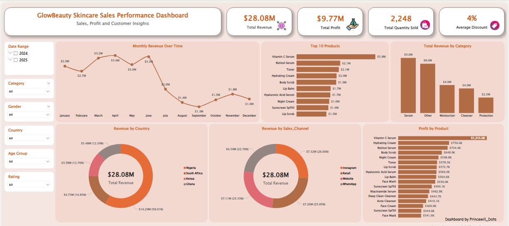
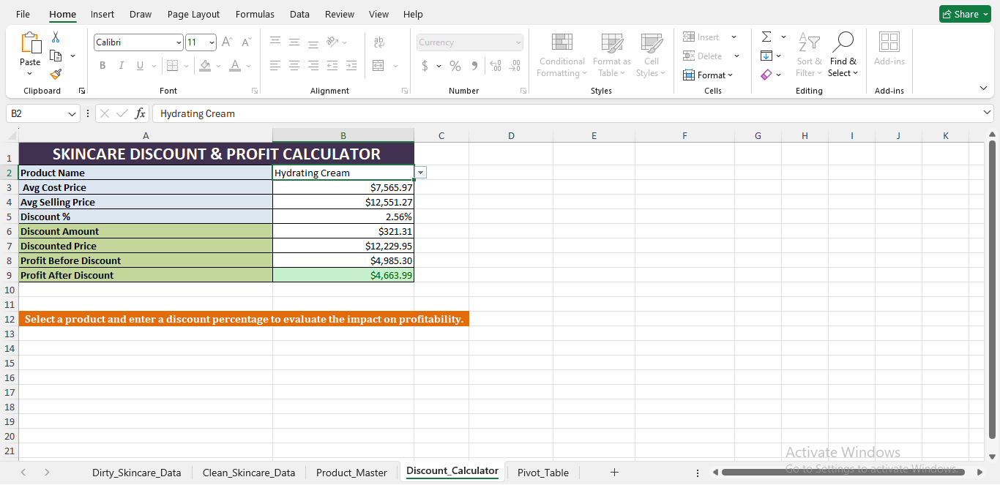
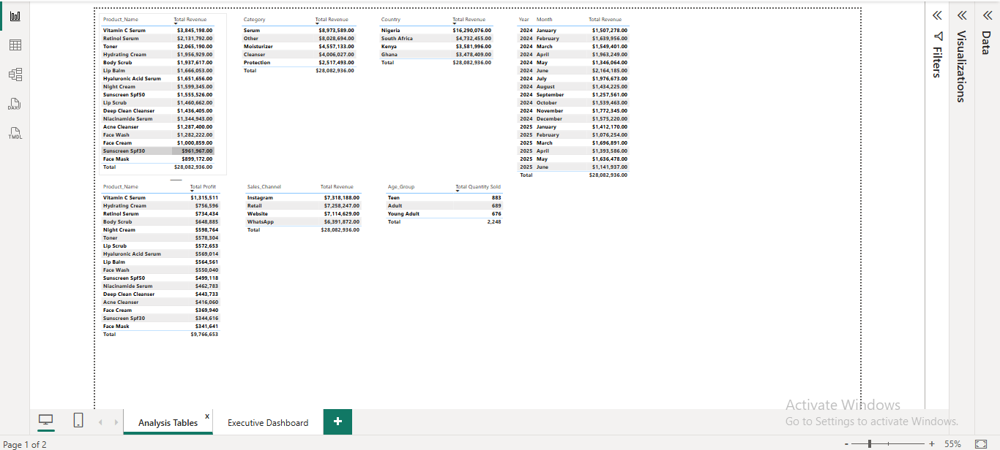

# GlowBeauty Skincare Sales Analysis


## Project Overview

This project presents an end to end sales analysis solution for a skincare business using Microsoft Excel and Power BI.

The workflow covers data cleaning, transformation, business calculations, exploratory analysis and dashboard development to help management monitor business 
performance and make informed decisions.

---

## Business Problem

The business needed a simple way to monitor sales performance across products, customer segments, sales channels and countries while understanding how discounts 
affect profitability.

Without a centralized dashboard, decision makers would spend significant time preparing reports before identifying trends and opportunities.

---

## Business Questions Answered

This dashboard helps answer questions such as:

- Which products generate the highest revenue?
- Which products generate the highest profit?
- Which product categories perform best?
- How does revenue change over time?
- Which sales channels contribute the most revenue?
- Which countries generate the highest sales?
- How do discounts impact profitability?
- How does performance change across customer age groups, gender, ratings, and time periods?

---

## Project Workflow

### Excel

- Cleaned and standardized a 500 row skincare sales dataset
- Corrected inconsistent values
- Built a Product Master using AVERAGEIFS
- Created a dynamic Discount & Profit Calculator using XLOOKUP
- Built Pivot Tables
- Created interactive Pivot Charts

### Power BI

- Imported cleaned dataset
- Created DAX measures
- Built analysis tables
- Designed an interactive executive dashboard
- Added slicers for dynamic filtering
- Applied a premium skincare themed design

---

## Dashboard Preview

### Excel Discount Calculator



---

### Excel Pivot Analysis


---

### Power BI Analysis Tables



---

### Power BI Executive Dashboard


---

## Key Insights

- Serum products generated the highest revenue.
- Revenue peaked during the first half of the year before declining later in the year.
- Nigeria contributed the largest share of total revenue.
- Sales performance varied across different sales channels.
- Interactive filters allow management to explore performance by country, category, gender, age group, customer rating, and date.

---

## Tools Used

- Microsoft Excel
- Pivot Tables
- Pivot Charts
- XLOOKUP
- AVERAGEIFS
- Power BI
- DAX

---

## Skills Demonstrated

- Data Cleaning
- Data Transformation
- Data Analysis
- Dashboard Development
- Business Intelligence
- Data Visualization
- KPI Reporting
- Interactive Reporting
- Business Storytelling

---

## Repository Structure

```
Dashboard_Images/
Excel_Analysis/
PowerBI_Dashboard/
```

---

## About

This project was developed as part of my Data Analytics portfolio to demonstrate practical business intelligence skills using Excel and Power BI.

Connect with me on LinkedIn for more analytics projects and insights @Princewill_Data                     
---
**Created by Princewill_Data**

*Pressing Data into Insights.*
